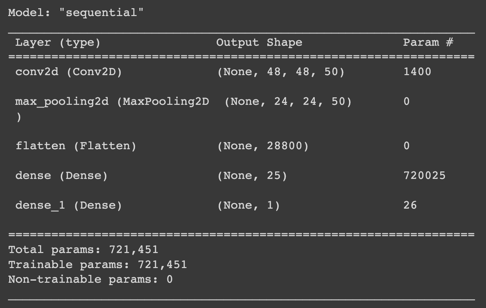

# Home-Architecture-Image-Classification

## CLICK [HERE](robotscott94.github.io/Architecture-Image-Classification/) TO VIEW CLASSIFICATION APP

## Purpose: 
The purpose of this project is to use image classification of different architectural styles common in the Charlotte Metro area and sort them into two broad categories: Modern vs Traditional. 

## Plan:
  1. Use Keras to import and normalize the image data and split the images into testing and training groups. 
  2. Build a neural network to classify the home types. 
  3. Test the model to evaluate accuracy and make improvements.
  4. Use HTML to build a website to classify an image: the website will allow someone to upload an image which will then classify the image among the Modern or Traditional style. ()
  5. Use Railway to help build / access the website: https://github.com/robotscott94/Image-Classification-Backend

## Applications/Tools:
  1. Machine Learning: 
      - Scikit-learn
      - Keras - implementing neural networks
      - cv2 (OpenCV) & PIL (Pillow)- image processing/recognition
      - NumPy
  3. HTML/CSS
  4. Python Pandas / Python Matplotlib
  5. Railway

## Topic- Image Classification via Architectural Style: 
  1. Modern: Bauhaus , Deconstructivism, International Style, Postmodern, and Novelty Architecture
  2. Traditional: American Foursquare, Georgian, Tudor Revival, Greek Revival, Palladian, and Queen Anne Architecture.

## Model Details:
A neural network was designed and modified to achieve maximum accuracy while remaining computationally efficient. A summary of the model can be seen here: 

Certain layers are added to deal with the three-dimensional shape inherent to image data. The flatten layer takes the pixel values and makes them into one-dimensional arrays. 

## Results:
The accuracy of our model ends up being about 83%. The web application can be accessed using [this link](robotscott94.github.io/Architecture-Image-Classification/). Also, the code for the back-end API launched on Railway can be seen [here](https://github.com/robotscott94/Image-Classification-Backend).

Data Source: Kaggle (images of 100-200 per style) 
- https://www.kaggle.com/datasets/dumitrux/architectural-styles-dataset?resource=download

References: 

-https://github.com/dumitrux/architectural-style-recognition/tree/master
-https://www.tensorflow.org/tutorials/images/classification

